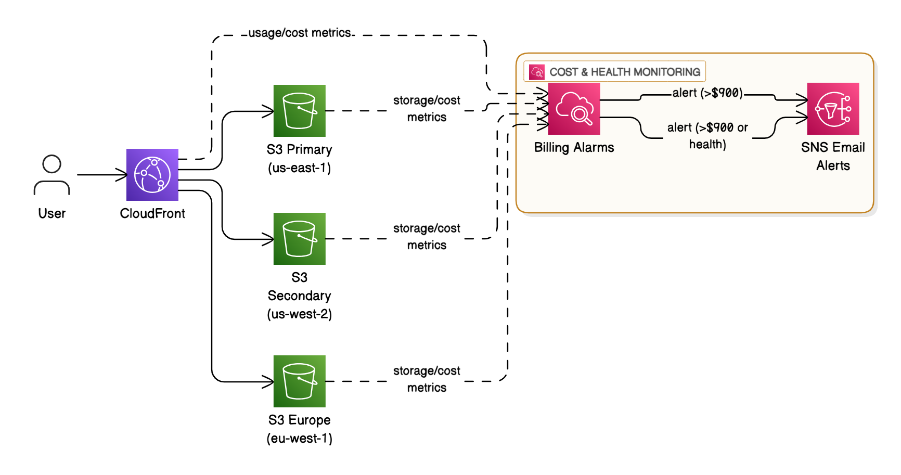

# Simple Video Hosting on AWS

A cost-effective video hosting service using S3 and CloudFront, designed to stay within a $1000/month budget.

## Architecture



**Components:**
- **S3**: Video storage with lifecycle policies
- **CloudFront**: Global CDN for video delivery
- **Monitoring**: Cost alerts at $900 threshold

## Cost (Monthly)
- S3 Storage: $23-50
- CloudFront: $85-200
- **Total: $114-270** (well within $1000 budget)

## Quick Start

1. **Setup**
   ```bash
   git clone <repository>
   cd aws-s3-cloudfront-terraform
   cp terraform.tfvars.example terraform.tfvars
   ```

2. **Configure**
   Edit `terraform.tfvars`:
   ```hcl
   aws_region = "us-east-1"
   alert_email = "your-email@domain.com"
   service_name = "my-video-service"
   ```

3. **Deploy**
   ```bash
   terraform init
   terraform apply
   ```

## Usage

**Upload videos:**
```bash
aws s3 cp my-video.mp4 s3://your-bucket-name/videos/
```

**Access videos:**
```
https://your-cloudfront-domain/videos/filename.mp4
```

**Monitor costs:**
- Email alerts when costs exceed $900

## Cleanup

```bash
terraform destroy
```